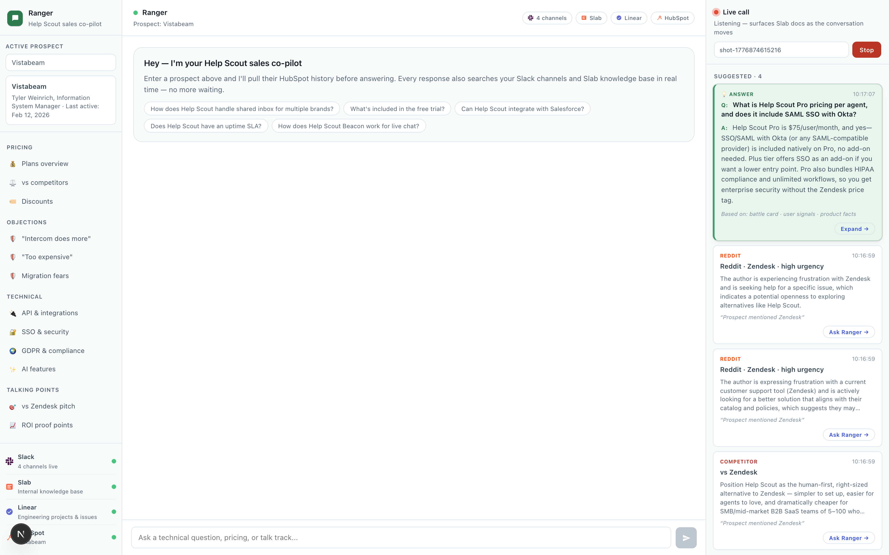

# Ranger — Help Scout Sales Co-pilot

Ranger is an AI-powered sales assistant that sits next to an Account Executive during a live call and surfaces the right internal context the moment a prospect mentions a topic. It also answers ad-hoc questions in a chat pane with full attribution to its sources.

The goal: AEs never have to say *"let me check and get back to you"* for anything the company already knows.



## What it does

Three surfaces, one brain:

| Surface | What it does | Behavior |
|---|---|---|
| **Main chat** (center) | Answers AE questions with streaming responses + source-attribution pills | Replies collapse to a 1–2 sentence lead; *Show more* expands supporting detail |
| **Live call panel** (right) | Ingests transcript chunks via a source-agnostic webhook, surfaces cards in real-time as topics come up | 💡 Answer card on top (Q→A synthesis); raw source cards below; click-to-chat to expand |
| **Prospect sidebar** (left) | Loads a HubSpot company's deal stage, value, owner, last activity, primary contact | Typing debounces, 60s cache, inline card under the input |

## Data sources

Six integrations feeding the brain:

| Source | How it's wired | Refresh |
|---|---|---|
| **Slab** (internal knowledge base) | Server-side MCP proxy (host is on internal DNS Anthropic can't resolve) | Live per request |
| **Slack** | User OAuth token (`xoxp-...`) via Slack MCP + direct `search.messages` fallback for triage | Live per request |
| **Linear** | GraphQL with personal API key + Linear MCP | Live per request |
| **HubSpot** | Private App REST API (not OAuth — stand-alone path) | Live per request |
| **helpscout.com product fact-sheet** | Scraped + Sonnet-synthesized → `data/product/helpscout.json` → injected into every chat reply's system prompt | Weekly CI |
| **Competitor battle cards** | Scraped competitor sites + Slab/Slack + Reddit signals → Sonnet-synthesized → `data/competitors/<slug>.json` | Weekly CI |
| **Reddit signals** from `#z-reddigent` | Slack search for bot-scored Reddit posts → parse score/urgency/reason/URL → Sonnet synthesizes top patterns → `data/reddit-signals/<slug>.json` | Daily CI |

## Architecture

```
 Any transcript source (Zoom RTMS / Fireflies / curl / local Whisper)
                                │
                                ▼
                 POST /api/transcript/ingest
                                │
                        ┌───────┴────────┐
                        │ transcript-store│  per-meeting ring buffer + EventEmitter
                        └───────┬────────┘
                                │ new chunk → event-driven triage
                                ▼
                     ┌──────────────────┐
                     │ Haiku: decide +  │  extracts trigger + question + per-source queries
                     │ extract question │
                     └──────────┬───────┘
                                │
            ┌───────────┬───────┼──────────┬──────────┐
            ▼           ▼       ▼          ▼          ▼
          Slab        Slack  Linear   Competitor   Reddit
         search      search  search   (regex fast   signals
            │           │      │       path)         │
            └───────────┴──────┴───────────┴─────────┘
                                │ Card[] surfaced as they return
                                ▼
                     ┌────────────────────┐
                     │ Haiku: synthesize  │  Q + source snippets + product facts
                     │ Answer card        │  → 2–4 sentence answer
                     └──────────┬─────────┘
                                │
                                ▼
                 GET /api/transcript/stream (SSE fanout)
                                │
                                ▼
                       LiveCallPanel.tsx
```

Main chat flow is similar but driven by the AE's message instead of a transcript chunk — the system prompt is assembled from pre-fetched product facts, competitor battle cards (if any are mentioned), and prospect HubSpot context (if loaded), then streamed through Sonnet with Slack/Linear MCP tools available for ad-hoc search.

## Tech stack

- **Next.js 15** (App Router), **React 19**, **TypeScript 5**
- **Anthropic SDK** — Sonnet 4.6 for chat + batch synthesis; Haiku 4.5 for live-call triage (event-driven cadence, cheap + fast)
- **MCP** for Slack + Linear integrations (`mcp-client-2025-04-04` beta)
- **Server-Sent Events** for live-call transcript streaming
- **CSS Modules** — [Help Scout Design System](./HelpScoutRangerDesign.md) applied; light by default, cobalt-blue actions + ranger-green identity layer
- **Node 22+** for scripts (uses `--experimental-strip-types` to run TypeScript directly)
- **puppeteer-core** for repeatable UI screenshots

## Setup

### 1. Install

```bash
npm install
```

### 2. Environment

```bash
cp .env.example .env.local
```

Fill in the keys. At minimum you need `ANTHROPIC_API_KEY`; the rest degrade gracefully if missing. See `.env.example` for the full list and comments on how to get each token.

| Env var | Required | How to get |
|---|---|---|
| `ANTHROPIC_API_KEY` | ✅ | console.anthropic.com |
| `SLACK_TOKEN` | Recommended | `xoxp-...` user token — api.slack.com/apps → create app → User Token Scopes: `search:read.public`, `search:read.private`, `channels:history`, `groups:history`, `users:read` → Install to Workspace → enable MCP server access on app settings |
| `HUBSPOT_TOKEN` | Recommended | `pat-...` Private App token — app.hubspot.com → Settings → Integrations → Private Apps → scopes: `crm.objects.companies.read`, `crm.objects.contacts.read`, `crm.objects.deals.read`, `crm.objects.owners.read` |
| `LINEAR_API_KEY` | Optional | linear.app/settings/api |
| `SLAB_MCP_URL` | Optional | Defaults to HS nonprod; only reachable on-VPN |
| `SLAB_DISABLED` | Optional | Set to `1` if you know you'll never have VPN access — silences the "Slab unreachable" log line |

### 3. Run

```bash
npm run dev
```

Open [http://localhost:3000](http://localhost:3000).

## Daily usage

### Live call panel

1. Enter a meeting ID (any string — e.g. `zoom-8471234`) in the right panel and click **Start**
2. Feed transcript chunks from any source — Zoom RTMS webhook, Fireflies, local Whisper, or just curl:
   ```bash
   curl -X POST http://localhost:3000/api/transcript/ingest \
     -H 'Content-Type: application/json' \
     -d '{"meetingId":"zoom-8471234","speaker":"prospect","text":"Do you have a Slack integration?"}'
   ```
3. Cards appear in the panel in ~1–2s:
   - **💡 Answer** (ranger green, synthesized Q→A)
   - Source cards below: Slack threads, Slab docs, Linear issues, competitor battle cards, Reddit signals
4. Click any card body to open the source URL; click **Ask Ranger →** to drop a follow-up prompt into the main chat

### Main chat

- Type a question, hit Enter. Replies stream in; the bubble collapses to the 1–2 sentence lead when complete with a **Show more ↓** toggle for detail.
- Source-attribution pills appear below the reply (Slack, Slab, Linear, HubSpot, ⚔ Battle card, 👤 Reddit signals).
- Load a prospect (sidebar, top-left) to have HubSpot context automatically merged into every reply.

## Refresh pipelines

Structured batch jobs that keep the "pre-fetched" data layers fresh. Each opens a PR against `data/**` for sales-engineering review — no direct commits to main. Run locally or via CI.

| Script | Purpose | Cadence (CI) | How to run |
|---|---|---|---|
| `refresh-competitors` | Scrapes competitor sites + Slab/Slack/Reddit → synthesizes battle cards | Weekly (Mon 09:00 UTC) | `npm run refresh-competitors [slug]...` |
| `refresh-product-knowledge` | Scrapes 11 helpscout.com pages → product fact-sheet (pricing, features, security, URLs) | Weekly (Tue 09:00 UTC) | `npm run refresh-product-knowledge` |
| `refresh-reddit-signals` | Pulls + parses bot-scored posts from `#z-reddigent` per competitor → signals + top patterns | Daily (10:00 UTC) | `npm run refresh-reddit-signals [slug]...` |
| `screenshot-ui` | Puppeteer-driven capture of the UI in a populated state — demos, docs, PRs | On demand | `npm run screenshot-ui` (requires dev server running) |

CI secrets required: `ANTHROPIC_API_KEY`, `SLACK_TOKEN`. GitHub → Settings → Actions → General → enable *Read and write permissions* + *Allow GitHub Actions to create and approve pull requests*.

## Design system

Ranger implements the [Help Scout Design System (HSDS)](./HelpScoutRangerDesign.md):

- **Light by default** — white canvas on `#f9fafa`, no dark mode
- **Cobalt 600** (`#304ddb`) as the system-wide action color — send button, links, focus rings
- **Ranger Green 600** (`#2d7a4f`) as the "park ranger speaking" identity — logo, assistant avatar, Answer-card chrome
- **Charcoal ladder** — three text loudness levels (`#405261` body → `#314351` dark → `#131b24` headline)
- **Soft compound shadows** for elevation, never hairlines
- **Two-layer focus ring** (cobalt inner + translucent outer halo) on every focusable element
- **AI plum** (`#9747FC`) reserved for surfaces that need to distinctly flag "this is AI-drafted" — currently tokens-only, no UI using it yet

## Project structure

```
.
├── app/
│   ├── api/
│   │   ├── chat/route.ts              Main chat — streams Anthropic responses,
│   │   │                               injects product facts + competitor cards +
│   │   │                               Reddit signals + HubSpot prospect context
│   │   ├── prospect/route.ts          HubSpot REST lookup (company → deal + contact)
│   │   └── transcript/
│   │       ├── ingest/route.ts        POST — source-agnostic webhook for transcripts
│   │       └── stream/route.ts        GET  — SSE fanout of events per meeting
│   ├── components/
│   │   ├── CoPilot.tsx                Main UI — sidebar + chat + live-call-panel wrapper
│   │   ├── CoPilot.module.css         HSDS-compliant styles
│   │   └── LiveCallPanel.tsx          Right panel — SSE client, card rendering,
│   │                                   click-to-chat prompt generation
│   ├── lib/
│   │   ├── constants.ts               SYSTEM_PROMPT, MCP config, SLACK_CHANNELS,
│   │   │                               SONNET_MODEL / HAIKU_MODEL centralized
│   │   ├── transcript-store.ts        Per-meeting ring buffer + EventEmitter
│   │   ├── triage.ts                  Haiku-driven triage loop: trigger → queries
│   │   │                               → Slab/Slack/Linear/Competitor/Reddit surfaces
│   │   │                               → Answer synthesis
│   │   ├── slab.ts                    Slab MCP client with unreachability cache
│   │   ├── slack-search.ts            Direct Slack Web API search for triage
│   │   ├── linear-search.ts           Direct Linear GraphQL search for triage
│   │   ├── hubspot.ts                 HubSpot CRM REST client + prospect formatter
│   │   ├── competitors/
│   │   │   ├── config.ts              COMPETITORS list (slug, aliases, URLs)
│   │   │   ├── schema.ts              CompetitorCard type
│   │   │   ├── detect.ts              Regex matcher for transcript + chat text
│   │   │   └── store.ts               Disk loader + formatCardForPrompt()
│   │   ├── product/
│   │   │   ├── schema.ts              ProductKnowledge type
│   │   │   └── store.ts               Disk loader + formatProductKnowledgeForPrompt()
│   │   └── reddit-signals/
│   │       ├── schema.ts              RedditSignal + RedditSignalsForCompetitor
│   │       └── store.ts               Disk loader + topSignals() ranker
│   ├── globals.css                    HSDS design tokens as CSS variables
│   ├── layout.tsx
│   └── page.tsx
├── data/
│   ├── competitors/                   zendesk.json, intercom.json, freshdesk.json
│   ├── product/helpscout.json         Refreshable product fact-sheet
│   └── reddit-signals/                Daily-refreshed signals per competitor
├── scripts/
│   ├── refresh-competitors.ts         Self-contained batch pipeline (CLI entry)
│   ├── refresh-product-knowledge.ts
│   ├── refresh-reddit-signals.ts
│   └── screenshot-ui.ts
├── .github/workflows/
│   ├── refresh-competitors.yml        Weekly CI, PR-driven
│   ├── refresh-product-knowledge.yml  Weekly CI, PR-driven
│   └── refresh-reddit-signals.yml     Daily CI, PR-driven
├── instrumentation.ts                 Node 25 localStorage shim — SDK needs it
├── next.config.mjs                    Manual .env.local loader (Node 25 workaround)
├── HelpScoutRangerDesign.md           HSDS reference — how colors/radii/shadows map
├── .env.example                       Documented env vars
└── package.json
```

## Deployment

### Vercel

```bash
npm i -g vercel
vercel
```

Add each env var in the Vercel project settings. API keys stay server-side — never exposed to the browser.

### Notes on reachability from hosted runners

- **Slab** won't be reachable from Vercel / GitHub Actions (internal DNS). The app degrades gracefully — `searchSlab()` short-circuits after the first failure for 5 min with a single info log. To get Slab in CI/prod later, the cleanest fix is a Tailscale sidecar (~5 lines of workflow YAML + a machine-OAuth secret).
- **Slack / Linear / HubSpot** all use public hosts, no networking gotchas.
- **helpscout.com scraping** works from any public runner — Help Scout's site doesn't bot-block the realistic UA we send.

## Costs

Rough order of magnitude with current settings:

| Surface | Model | Cost per unit | Notes |
|---|---|---|---|
| Main chat reply | Sonnet 4.6 | ~$0.02/reply | Streaming; ~3–8k input + 1–2k output |
| Triage decision | Haiku 4.5 | ~$0.0001/decision | Event-driven cadence; ~225–900 calls per 30-min call |
| Answer synthesis | Haiku 4.5 | ~$0.00015/answer | One per triggered question |
| Competitor refresh | Sonnet 4.6 | ~$0.06 per competitor | Weekly × 3 competitors = ~$0.20/wk |
| Product fact refresh | Sonnet 4.6 | ~$0.06/week | Weekly, one pass |
| Reddit signal refresh | Sonnet 4.6 | ~$0.02/day total | Pattern synthesis only, cheap |

A typical 30-min call with active triage + 10 chat replies lands around $0.30–$0.50.

## Contributing

- **Data changes** (competitor cards, product facts, Reddit signals) land via auto-opened PRs from CI — review the diffs for factual accuracy, not formatting
- **Code changes** — typecheck with `npx tsc --noEmit`, keep the UI in HSDS compliance (see [HelpScoutRangerDesign.md](./HelpScoutRangerDesign.md))
- **System prompt / triage prompt edits** — these have meaningful downstream effects; worth manually exercising `npm run dev` with a few representative questions before shipping

## License

Internal Help Scout project — not for external distribution.
